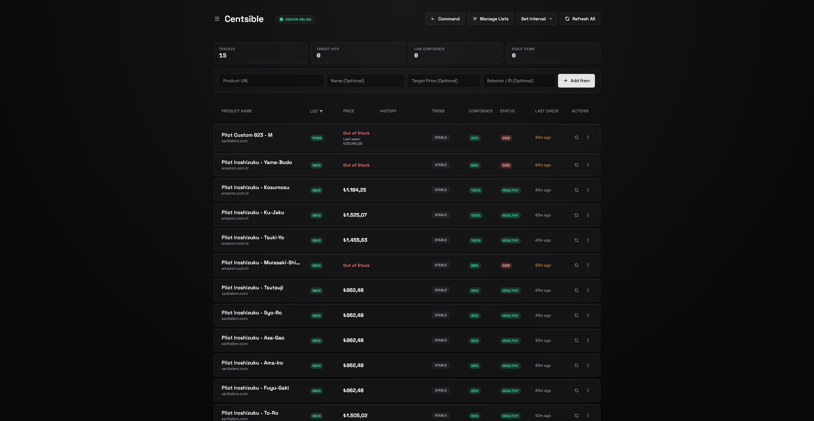
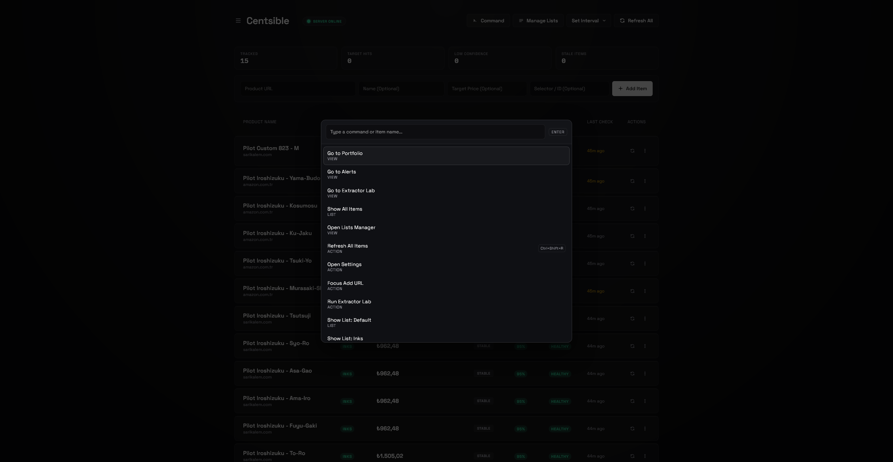
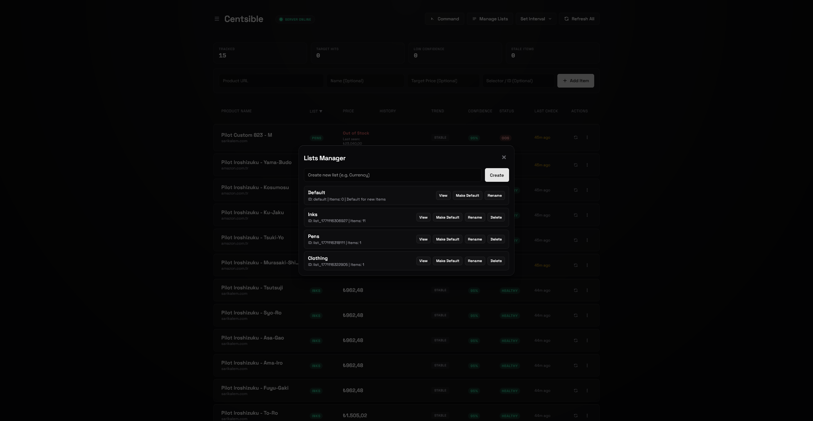
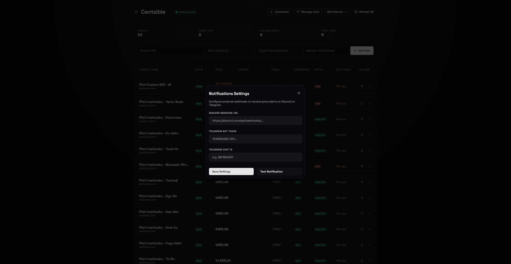
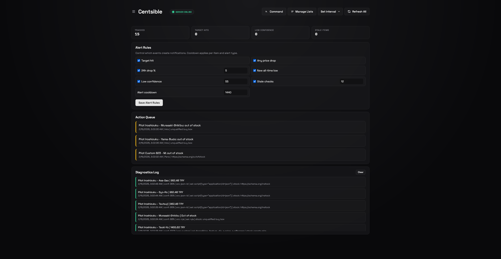
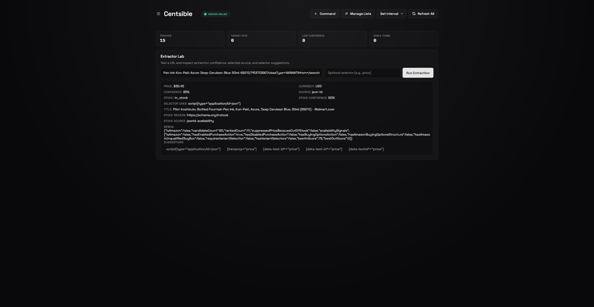
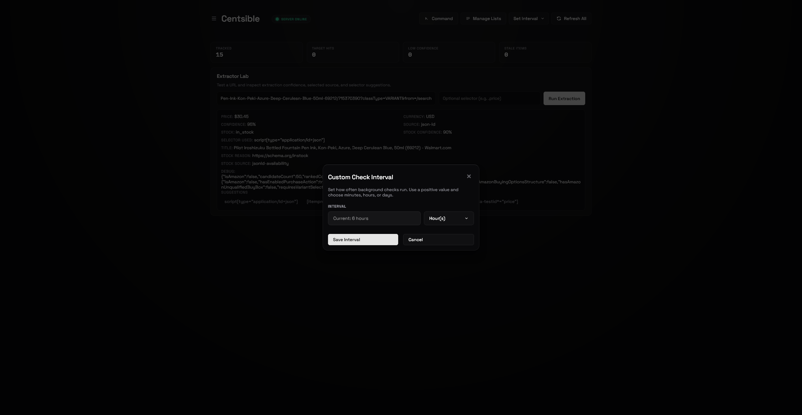
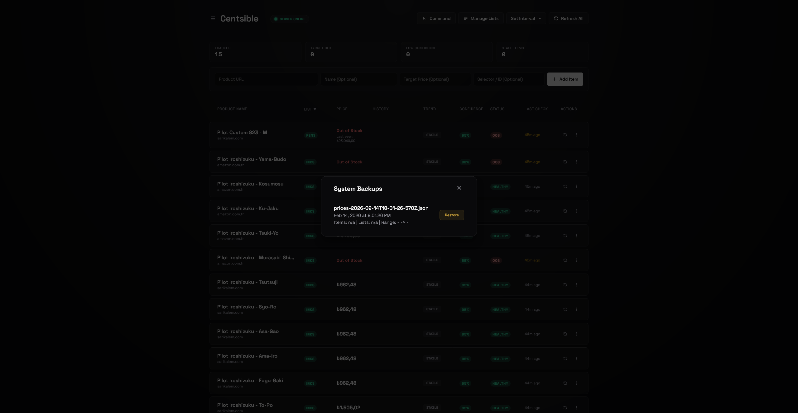

# Centsible

Centsible is a self-hosted price tracking application that monitors product prices across multiple websites. It provides data visualization, historical tracking, and automated alerts via Discord or Telegram.

<table border="0">
  <tr>
    <td></td>
    <td></td>
    <td></td>
    <td></td>
  </tr>
  <tr>
    <td align="center">Main Page</td>
    <td align="center">Command Palette</td>
    <td align="center">Lists Manager</td>
    <td align="center">Notification Settings</td>
  </tr>
  <tr>
    <td></td>
    <td></td>
    <td></td>
    <td></td>
  </tr>
  <tr>
    <td align="center">Alerts & Diagnostics</td>
    <td align="center">Extractor Lab</td>
    <td align="center">Custom Intervals</td>
    <td align="center">Automated Backups</td>
  </tr>
</table>

## Features

- **Price Extraction**: Automated price retrieval using Cheerio for static pages and Puppeteer Stealth for dynamic content.
- **Price History**: Interactive charts showing price trends over time.
- **Alert System**:
    - Target price notifications.
    - General price drop alerts.
    - Out of stock alerts.
    - 24-hour percentage drop tracking.
    - All-time low detection.
- **Notifications**: Support for Discord Webhooks and Telegram Bot API.
- **Extractor Lab**: Tool for testing and configuring custom CSS selectors for specific sites.
- **Currency Support**: Automatic detection and conversion between major currencies (USD, EUR, GBP, TRY, JPY, etc.) using live rates.
- **Data Management**: JSON and CSV export/import, plus automated local backups.
- **Command Palette**: Keyboard-accessible (Ctrl/Cmd+K) interface for rapid navigation.
- **Deployment**: Includes Docker and Docker Compose configuration.

## Technical Stack

- **Frontend**: HTML5, Vanilla JavaScript, CSS.
- **Backend**: Node.js, Express.
- **Scraping**: Puppeteer, Cheerio, Axios.
- **Storage**: Local JSON files.

## Installation

### Docker (Recommended)

1. Clone the repository.
2. `cp .env.example .env` and configure variables.
3. Run `docker-compose up -d`.
4. Access the UI at `http://localhost:3000`.

### Manual Setup

1. Clone the repository.
2. Navigate to `server` directory and run `npm install`.
3. Create a `.env` file in the root based on `.env.example`.
4. Run `npm start`.

## Configuration

The following environment variables can be set in the `.env` file:

| Variable | Description | Default |
| :--- | :--- | :--- |
| `PORT` | Server port | `3000` |
| `DISCORD_WEBHOOK` | Discord Webhook URL for alerts | - |
| `DISCORD_PROXY_BASE` | Optional proxy base for Discord webhooks | - |
| `TELEGRAM_BOT_TOKEN` | Telegram Bot API token | - |
| `TELEGRAM_CHAT_ID` | Telegram Chat ID | - |
| `ALLOWED_ORIGINS` | CORS allowed origins (comma-separated). Leave empty to allow all origins. | empty |
| `FETCH_ALLOWED_HOSTS` | Whitelisted hostnames for tracking | - |

### Unraid / LAN CORS setup

If the UI is opened from another host (for example `http://192.168.1.50:3000`), set `ALLOWED_ORIGINS` to that exact origin (or origins), separated by commas.

Examples:

- `ALLOWED_ORIGINS=http://192.168.1.50:3000`
- `ALLOWED_ORIGINS=http://192.168.1.50:3000,http://localhost:3000`

## Custom Selectors

If the automated extractor fails on a specific site, use the **Extractor Lab** to provide a custom CSS selector. Once verified, the application will use that selector for future checks of that item.

## Backup and Portability

Database state is stored in `prices.json`. Scheduled backups are saved to the `backups/` directory. Portfolios can be moved by transferring the `prices.json` and `settings.json` files.

## License

Released under the [MIT License](https://github.com/aloglu/centsible/blob/main/LICENSE).